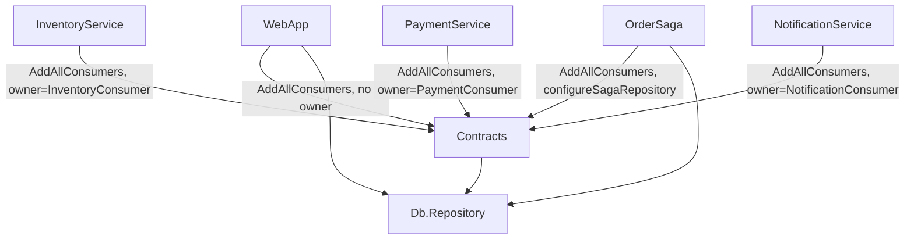
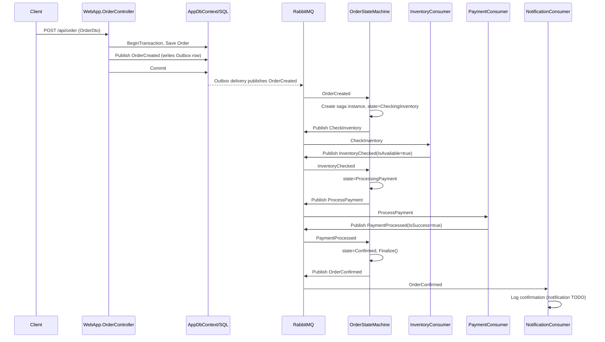
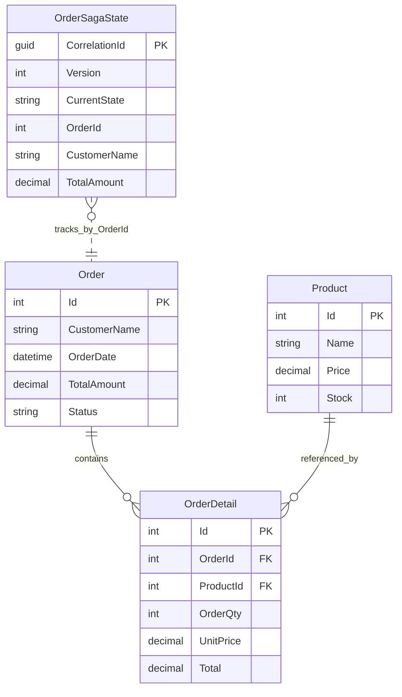
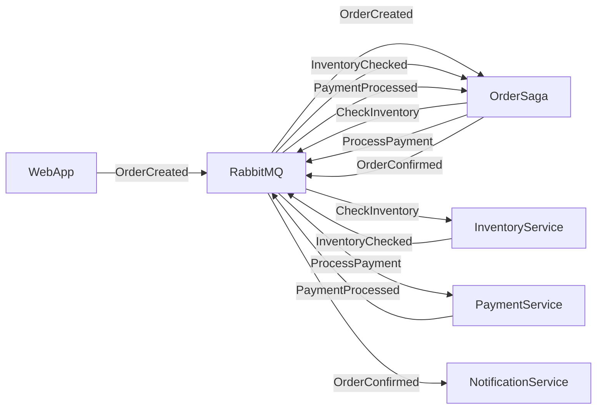

# MicroService — Saga-Based Order Processing System

## Overview

A .NET 10 microservices reference system demonstrating **event-driven order processing** using **MassTransit + RabbitMQ** with a **saga state machine** orchestrating inventory checks and payment processing across independently deployable services. Each business step (inventory, payment, notification) is owned by its own worker process; a saga (`OrderStateMachine`) coordinates the workflow end-to-end with EF Core-backed state persistence, transactional outbox, and automatic message retry.

This is a demo/reference implementation: inventory and payment logic are stubbed (`TODO`, hardcoded `true`), there is no authentication, and there are no automated tests. It is best read as an architectural blueprint for the outbox/saga/topology patterns it implements, not as production-ready code.

## Business Domain

E-commerce order lifecycle: a customer order is created → inventory is checked → payment is processed → the order is confirmed and a notification is sent. Failure at any step routes the saga to a terminal `Failed` state (no compensation logic implemented yet).

## Main Features

- REST API for order CRUD (`WebApp`)
- Background order simulator that generates random orders on a timer, for demoing the pipeline without manual input
- Saga-orchestrated order workflow (`OrderSaga`) with optimistic concurrency
- Three independent worker services for inventory, payment, and notification, each owning exactly one RabbitMQ queue
- Transactional outbox on every publisher (API and saga) and transactional inbox/outbox on every consumer
- Built-in MassTransit dashboard for visualizing the full message topology across all services
- Automatic message retry (5s / 15s / 30s) on every receive endpoint

## Technology Stack

| Concern | Technology |
|---|---|
| Runtime | .NET 10 (net10.0) |
| API | ASP.NET Core Web API + Swagger (Swashbuckle) |
| Messaging | MassTransit `9.2.0-develop.150` over RabbitMQ |
| Saga persistence | MassTransit EF Core saga repository (optimistic concurrency) |
| Reliability | MassTransit transactional Outbox/Inbox (EF Core) |
| Serialization | Newtonsoft JSON (not the MassTransit default System.Text.Json) |
| ORM | EF Core 10 (`Microsoft.EntityFrameworkCore.SqlServer`) |
| Database | SQL Server (`OrderDB`) |
| Mapping | AutoMapper |
| Background work | `BackgroundService` (Generic Host) |

## Architectural Style

**Distributed, choreography-light / orchestration-heavy microservices** built around an **Event-Driven Architecture** with a central **Saga (process manager) pattern** for cross-service orchestration:

- **Microservices**: `WebApp`, `OrderSaga`, `InventoryService`, `PaymentService`, `NotificationService` are independently runnable processes, each with its own `Program.cs`/host and `appsettings.json`.
- **Event-Driven**: services communicate exclusively via asynchronous messages (`OrderCreated`, `CheckInventory`, `InventoryChecked`, `ProcessPayment`, `PaymentProcessed`, `OrderConfirmed`) over RabbitMQ — no synchronous service-to-service HTTP calls exist.
- **Saga / Orchestration**: `OrderStateMachine` (Contracts/Saga) is the explicit orchestrator — it owns the workflow sequence and emits commands (`CheckInventory`, `ProcessPayment`) rather than services choreographing themselves.
- **Not** Clean/Onion/Hexagonal layered architecture internally — each service is a thin host (DI + MassTransit wiring) with no internal Application/Domain/Infrastructure layering; `Contracts` and `Db.Repository` play the role of a shared kernel instead of per-service layers.
- **Not CQRS** — no separate command/query handler pipeline (no MediatR); `OrderController` talks to `AppDbContext` directly.
- **Light DDD** — entities (`Order`, `Product`, `OrderDetail`, `OrderSagaState`) model the domain, but there's no aggregate root enforcement, no domain events distinct from the integration events, and no encapsulated invariants (all properties are public auto-properties).

Evidence: `src/Contracts/BusTopologyExtensions.cs` (shared topology registration), `src/Contracts/Saga/OrderStateMachine.cs` (explicit orchestration), per-service `Program.cs` (no inter-service HTTP clients anywhere in the repo).

## Solution Structure

```
MicroService.sln
├── src/WebApp                 — ASP.NET Core API, publish-only bus, MassTransit dashboard, order simulator
├── src/OrderSaga               — Worker host owning OrderStateMachine (EF saga repository)
├── src/InventoryService        — Worker host owning InventoryConsumer (inventory-queue)
├── src/PaymentService           — Worker host owning PaymentConsumer (payment-queue)
├── src/NotificationService      — Worker host owning NotificationConsumer (notification-queue)
├── src/Contracts                — Shared message contracts, saga definition, all consumer impls, DTOs, topology helper
└── src/Db.Repository             — AppDbContext, entities, EF Core migrations (shared by every service)
```

### Responsibilities & Dependencies

| Project | Type | Depends on | Owns |
|---|---|---|---|
| WebApp | ASP.NET Core Web API | Contracts, Db.Repository | `OrderCreated` publishing, REST API, dashboard, order simulator |
| OrderSaga | Worker | Contracts, Db.Repository | `OrderStateMachine` saga execution |
| InventoryService | Worker | Contracts | `InventoryConsumer` / `inventory-queue` |
| PaymentService | Worker | Contracts | `PaymentConsumer` / `payment-queue` |
| NotificationService | Worker | Contracts | `NotificationConsumer` / `notification-queue` |
| Contracts | Class library | Db.Repository | Message contracts, saga state machine, all consumers + definitions, DTOs |
| Db.Repository | Class library | — | `AppDbContext`, entities, migrations |

There is no separate Application/Domain/Infrastructure split — `Contracts` plays "shared message + behavior kernel," `Db.Repository` plays "shared persistence kernel." Each runnable service is essentially a composition root.

### The Shared-Topology Pattern (non-obvious, load-bearing)

Every service calls `AddAllConsumers()` (`src/Contracts/BusTopologyExtensions.cs`), registering **all** consumers and the saga in **every** process — not just the ones that process logically owns. This is intentional: it lets the MassTransit dashboard hosted in `WebApp` render the complete message topology/flow diagram across the whole system.

- The owning service passes `ownerConsumerType: typeof(XConsumer)`; every other service gets the consumer registered in DI but immediately `.ExcludeFromConfigureEndpoints()`'d, so no queue is created there.
- The saga is handled identically: only `OrderSaga` passes `configureSagaRepository` to wire the EF saga repository; everyone else excludes it from endpoint configuration.



## Request Flow

### HTTP order creation → saga kickoff

1. Client `POST`s to `/api/order` with an `OrderDto` body.
2. `OrderController.Create` begins an EF Core transaction.
3. `Order` entity (mapped from `OrderDto`) is saved → DB assigns `Order.Id`.
4. `OrderCreated` (wrapping the mapped `OrderDto`) is published via the bus — MassTransit's EF outbox interceptor writes it to the `OutboxMessage` table instead of sending immediately.
5. `SaveChangesAsync()` is called again to flush the outbox row.
6. Transaction commits — `Order` row and `OutboxMessage` row are atomic.
7. MassTransit's outbox delivery service (background, `QueryDelay=1s`) polls `OutboxMessage` and actually publishes `OrderCreated` to RabbitMQ.
8. `OrderStateMachine` (running in `OrderSaga`) receives `OrderCreated`, correlates by `OrderId`, creates a new saga instance (`CorrelationId = NewId.NextGuid()`), copies order data into `OrderSagaState`, and publishes `CheckInventory`.
9. `InventoryConsumer` (`InventoryService`) consumes `CheckInventory`, publishes `InventoryChecked` (hardcoded `IsAvailable = true`).
10. Saga transitions `CheckingInventory → ProcessingPayment`, publishes `ProcessPayment`.
11. `PaymentConsumer` (`PaymentService`) consumes `ProcessPayment`, publishes `PaymentProcessed` (hardcoded `IsSuccess = true`).
12. Saga transitions `ProcessingPayment → Confirmed`, publishes `OrderConfirmed`, and finalizes (`SetCompletedWhenFinalized`).
13. `NotificationConsumer` (`NotificationService`) consumes `OrderConfirmed`, logs confirmation (notification dispatch itself is a `TODO`).



## Database Design

`AppDbContext` (`src/Db.Repository/AppDbContext.cs`) is shared verbatim across every service (each registers its own instance against the same `OrderDB`).

### Entities

| Entity | Key fields | Notes |
|---|---|---|
| `Order` | `Id` (PK, int) | `CustomerName`, `OrderDate`, `TotalAmount` (decimal 18,2), `Status` |
| `OrderDetail` | `Id` (PK, int) | FK `OrderId` (cascade delete), FK `ProductId` (restrict delete), `OrderQty`, `UnitPrice`, `Total` |
| `Product` | `Id` (PK, int) | `Name`, `Price` (decimal 18,2), `Stock` — seeded with 5 rows |
| `OrderSagaState` | `CorrelationId` (PK, Guid) | `Version` (`ISagaVersion` optimistic concurrency), `CurrentState`, `OrderId`, `CustomerName`, `TotalAmount` |

Plus MassTransit-managed tables added via `modelBuilder.AddInboxStateEntity()`, `AddOutboxMessageEntity()`, `AddOutboxStateEntity()`: `InboxState`, `OutboxMessage`, `OutboxState`.



### Migrations

- `20260616132157_AddOrderSagaState` / `20260616133520_SeedProducts` — present under `WebApp/Migrations`
- `20260617085751_Init` — present under `Db.Repository/Migrations` (creates all tables incl. Inbox/Outbox, seeds 5 products)

Not enough evidence found in the repository to determine why two separate migration histories exist (WebApp has its own `Migrations/` folder in addition to `Db.Repository/Migrations/`) — this may be leftover from project restructuring and should be reconciled before relying on `dotnet ef database update` from a clean database.

### Repository / Unit of Work

No `IRepository<T>` or `IUnitOfWork` abstraction exists. `AppDbContext` is injected directly into `OrderController` and consumers; `AppDbContext` itself (via EF Core's `SaveChanges` + the surrounding `DbTransaction`) functions as the de facto unit of work.

## Messaging Architecture

### Contracts (`src/Contracts/Messages`, `Messages/Events`)

| Message | Fields | Published by | Consumed by |
|---|---|---|---|
| `OrderCreated` | `OrderDto Order` | `WebApp.OrderController`, `OrderSimulatorService` | `OrderStateMachine` |
| `CheckInventory` | `CorrelationId`, `OrderId` | `OrderStateMachine` | `InventoryConsumer` |
| `InventoryChecked` | `CorrelationId`, `OrderId`, `IsAvailable` | `InventoryConsumer` | `OrderStateMachine` |
| `ProcessPayment` | `CorrelationId`, `OrderId`, `Amount` | `OrderStateMachine` | `PaymentConsumer` |
| `PaymentProcessed` | `CorrelationId`, `OrderId`, `IsSuccess` | `PaymentConsumer` | `OrderStateMachine` |
| `OrderConfirmed` | `CorrelationId`, `OrderId`, `CustomerName`, `TotalAmount` | `OrderStateMachine` | `NotificationConsumer` |

### Queues

| Queue | Owner service | Endpoint name |
|---|---|---|
| `inventory-queue` | InventoryService | `order-inventory` |
| `payment-queue` | PaymentService | `order-payment` |
| `notification-queue` | NotificationService | `order-notification` |
| (saga endpoint, auto-named) | OrderSaga | — created by `ConfigureEndpoints` |

`WebApp` declares no receive endpoints — it is a publish-only bus (no queue created for it).



### Reliability conventions (every receive endpoint, in this exact order)

1. `UseMessageRetry` — outermost; intervals 5s / 15s / 30s
2. `UseEntityFrameworkOutbox<AppDbContext>` — atomic with the DB transaction
3. `ConfigureConsumer<T>` — innermost

Serialization is Newtonsoft JSON (`UseNewtonsoftJsonSerializer` / `UseNewtonsoftJsonDeserializer`) on every bus, not the MassTransit default System.Text.Json.

## Security Analysis

**Not enough evidence found in the repository** for any of the following — none are present:

- Authentication (no JWT, no cookie auth, no Identity)
- Authorization (no `[Authorize]` attributes anywhere)
- API key / secret management (connection strings and RabbitMQ credentials are plaintext in `appsettings.json`, including a hardcoded SQL `sa` password)
- HTTPS enforcement beyond ASP.NET Core defaults

This is acceptable for a local dev/demo system but is a **Critical** gap before any shared or internet-facing deployment.

## Design Patterns

| Pattern | Location | Purpose |
|---|---|---|
| Saga / Process Manager | `Contracts/Saga/OrderStateMachine.cs` | Orchestrates multi-step, multi-service workflow with durable state |
| Transactional Outbox | `OrderController.Create`, `OrderSimulatorService`, every `Program.cs` (`AddEntityFrameworkOutbox`) | Atomic "save + publish" without distributed transactions |
| Transactional Inbox (implicit via outbox config on consumers) | `InventoryService`/`PaymentService`/`NotificationService` `Program.cs` | Exactly-once-ish consumption alongside DB writes |
| Dependency Injection | All `Program.cs` (`AddDbContext`, `AddMassTransit`, `AddAutoMapper`) | Standard ASP.NET Core / Generic Host composition |
| Strategy-like ownership switch | `BusTopologyExtensions.AddConsumerWithOwnership` | Same registration code path produces different endpoint behavior based on `ownerConsumerType` |
| DTO / Mapping layer | `Contracts/Dto`, `WebApp/Mappings/MapperProfile.cs` (AutoMapper) | Decouples wire contracts from EF entities |

Not present: Repository, Unit of Work (beyond `DbContext` itself), Factory (beyond EF's `IDesignTimeDbContextFactory`), Mediator/CQRS, Decorator, Observer (beyond MassTransit's own pub/sub internals).

## API Documentation

Base route: `/api/order` (`src/WebApp/Controllers/OrderController.cs`)

| Method | Route | Request | Response | Description |
|---|---|---|---|---|
| GET | `/api/order` | — | `200 OK` → `List<OrderDto>` | All orders with details |
| GET | `/api/order/{id}` | `id: int` | `200 OK` → `OrderDto` | Single order with details |
| POST | `/api/order` | `OrderDto` | `201 Created` | Creates order, publishes `OrderCreated` via outbox |
| PUT | `/api/order/{id}` | `id: int`, `OrderDto` | `204 No Content` | Updates order + replaces `OrderDetails` |
| DELETE | `/api/order/{id}` | `id: int` | `204 No Content` | Deletes order (details cascade) |

### Models

```text
OrderDto         { Id, CustomerName, OrderDate, TotalAmount, Status, OrderDetails: OrderDetailDto[] }
OrderDetailDto   { Id, OrderId, ProductId, OrderQty, UnitPrice, Total }
ProductDto       { Id, Name, Price, Stock }
```

Swagger/OpenAPI is enabled via `Swashbuckle.AspNetCore` + `Swashbuckle.AspNetCore.Filters`, with a request example provider (`Swagger/OrderDtoExample.cs`) showing a sample two-line order. Available at the app's default Swagger UI route when running `WebApp`.

## Configuration

Each service's `appsettings.json` provides:

```json
{
  "ConnectionStrings": { "DefaultConnection": "Server=localhost;Database=OrderDB;User Id=sa;Password=Asdf1234;..." },
  "RabbitMQ": { "Host": "localhost", "VirtualHost": "/", "Username": "guest", "Password": "guest" },
  "Logging": { "LogLevel": { "Default": "Information", "Microsoft.Hosting.Lifetime": "Information" } }
}
```

`WebApp` additionally has:

```json
{
  "OrderSimulator": { "Enabled": true, "IntervalSeconds": 1 },
  "AllowedHosts": "*"
}
```

## DevOps & Deployment

**Not enough evidence found in the repository** — no `Dockerfile`, `docker-compose.yml`, Kubernetes manifests, or CI/CD pipeline definitions exist anywhere in the repo. Infrastructure (SQL Server, RabbitMQ) must be run and configured manually on `localhost` before any service will start.

## Getting Started

### Prerequisites

- .NET 10 SDK
- SQL Server reachable at `localhost` (matching the `sa`/`Password=Asdf1234` credentials in `appsettings.json`, or update them)
- RabbitMQ reachable at `localhost` with default `guest`/`guest` on vhost `/`

### Installation

```bash
dotnet build
```

### Database Setup

```bash
dotnet ef database update --project src/Db.Repository --startup-project src/WebApp
```

> Two migration histories currently exist (`WebApp/Migrations` and `Db.Repository/Migrations`) — verify which one applies cleanly to an empty database before relying on this in a new environment.

### Running RabbitMQ / SQL Server

Both must already be running locally; this repo does not provision them.

### Running the Application

Each service is a separate process — run in separate terminals:

```bash
dotnet run --project src/WebApp
dotnet run --project src/OrderSaga
dotnet run --project src/InventoryService
dotnet run --project src/PaymentService
dotnet run --project src/NotificationService
```

`WebApp` hosts Swagger and the MassTransit dashboard at its root (`/`).

## Project Structure

See [Solution Structure](#solution-structure) above.

## Deployment

Not enough evidence found in the repository.

## Security

See [Security Analysis](#security-analysis) — no auth/authz implemented; secrets are plaintext in committed `appsettings.json` files.

## Design Patterns Used

See [Design Patterns](#design-patterns) above.

## Future Improvements

See [Improvement Recommendations](#improvement-recommendations) below.

## Contributing

Not enough evidence found in the repository (no `CONTRIBUTING.md`, no PR template, no branch policy).

## License

Not enough evidence found in the repository (no `LICENSE` file present).

---

## Improvement Recommendations

### Critical

- **No authentication/authorization anywhere** — add at minimum API-key or JWT auth on `WebApp`, and lock down the MassTransit dashboard.
- **Plaintext secrets committed to source** (`sa`/`Asdf1234`, RabbitMQ `guest/guest`) — move to user secrets / environment variables / a secrets manager before any shared environment.
- **`Failed` saga state is a dead end** — no compensation, no notification, no retry-from-failure path; failed orders are silently stuck forever with no operator visibility.

### High Priority

- **Inventory and payment logic are hardcoded stubs** (`InventoryConsumer`, `PaymentConsumer` always return `true`) — replace with real checks before this is anything beyond a demo.
- **No automated tests** — no unit tests for the state machine transitions, no integration tests for the outbox/consumer pipeline.
- **Duplicate/conflicting EF migration histories** (`WebApp/Migrations` vs `Db.Repository/Migrations`) — reconcile into a single source of truth.
- **No containerization** — add Dockerfiles + docker-compose (including SQL Server and RabbitMQ) so the system is runnable without manual local infra setup.

### Medium Priority

- **No centralized logging/observability** beyond default console logging — consider structured logging (Serilog) and correlating logs by saga `CorrelationId` across services.
- **MassTransit dashboard exposed without restriction** — fine for local dev, but should not ship to a shared environment unbounded.
- **`OrderSagaState.ProductIds` is commented out** — saga currently can't see which products are in the order; needed for any real inventory check.

### Future Enhancements

- Introduce CQRS/MediatR if the API surface grows beyond simple CRUD.
- Add a dead-letter/compensation flow from `Failed` (e.g., a `CancelOrder` event back through inventory/payment to release holds/refund).
- Add CI (GitHub Actions) running `dotnet build`/`dotnet test` on PRs once tests exist.

---

## Executive Summary

This repo is a clean, focused demonstration of the **saga + transactional outbox** pattern in MassTransit/RabbitMQ across independently runnable .NET worker/web services. The shared-topology trick (`AddAllConsumers` + selective `ExcludeFromConfigureEndpoints`) to keep one unified dashboard view while still partitioning ownership per service is the most interesting and non-obvious architectural decision in the codebase. The system is coherent and consistent (retry/outbox/consumer middleware order is identical everywhere), but it is explicitly a skeleton: business logic in both downstream consumers is stubbed, there's no auth, no tests, and no deployment tooling. Treat it as a pattern reference, not a production base, until the Critical/High items above are addressed.

## Overall Architecture Score: 7/10

Consistent, well-factored event-driven/saga design with a genuinely clever shared-topology mechanism; loses points for the layering being entirely flat (no per-service domain/application separation) and the unresolved dual-migration-history issue.

## Production Readiness Score: 3/10

No auth, plaintext secrets, stubbed core business logic, no tests, no containerization/CI. Solid architectural bones, but several Critical items must be closed before this could run anywhere but a developer's machine.
